<div align="center">

# Wonderland

### 一句描述，走进一个像素世界。

[English](README.md) · **简体中文**

Zero-shot 场景生成 · 可探索的室内外 · Python + pygame-ce · OpenAI

</div>

Wonderland 把一段简短描述变成**可以走进去的 2D 像素世界**：地形、建筑、室内家具、实体碰撞，以及走到门前就能触发的进出交互。

描述一家超市、一间办公室、一座火山魔王城堡，或雪山中的木屋。让 agent 搭建场景，然后亲自走进去看看。

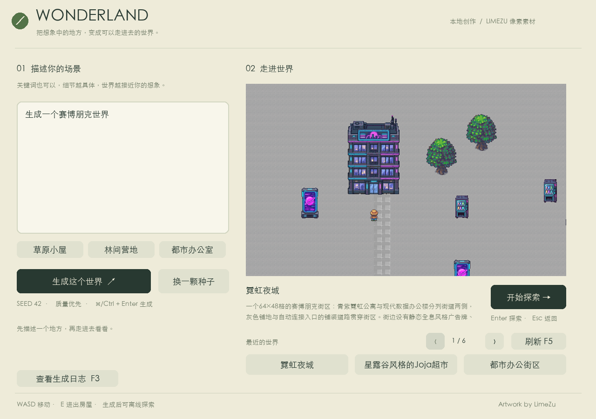

*真实运行的本地应用。输入「生成一个赛博朋克世界」，得到可探索的场景。当前 Demo 界面为中文。*

## Zero-shot：从描述到探索

**用户提供的就是描述。** 无需手动铺设 tile、为每个场景单独设计布局，也无需编写场景专用代码。

Agent 理解需求、检索合适素材，在缺少资源时生成美术，再由 Python 搭建并检查世界。已标注的素材库和布局规则构成基础，检查与重试也是流程的一部分。这里的 zero-shot 指用户的创作方式，并不承诺每次生成都能首轮成功。

- **建筑有内部空间。** 室外建筑连接到布置好家具的房间，通过门口进入和返回。
- **按需补齐美术。** 优先复用合适素材；缺失资源经过生成、规格化、检查和入库，可供后续场景再次使用。
- **生成后即可交互。** WASD 移动，与实体物件碰撞，在门前按 E 进出。
- **世界保存在本地。** 已保存场景可以重新打开、离线探索；生成调用 OpenAI API，渲染由本地 Python 完成。

```text
你的描述 → 场景规划 → 复用 / 生成素材 → 搭建与检查 → 进入探索
```

## 同一套流程，不同的世界

以下图片来自已保存、可探索的真实场景。场景展示图由游戏渲染器导出，应用运行图通过实际操作截取。[截图来源说明](docs/media/README.md)

### 超市

> 「生产星露谷物语同款的 joja 超市场景」

| 室外 | 室内 |
| :---: | :---: |
| 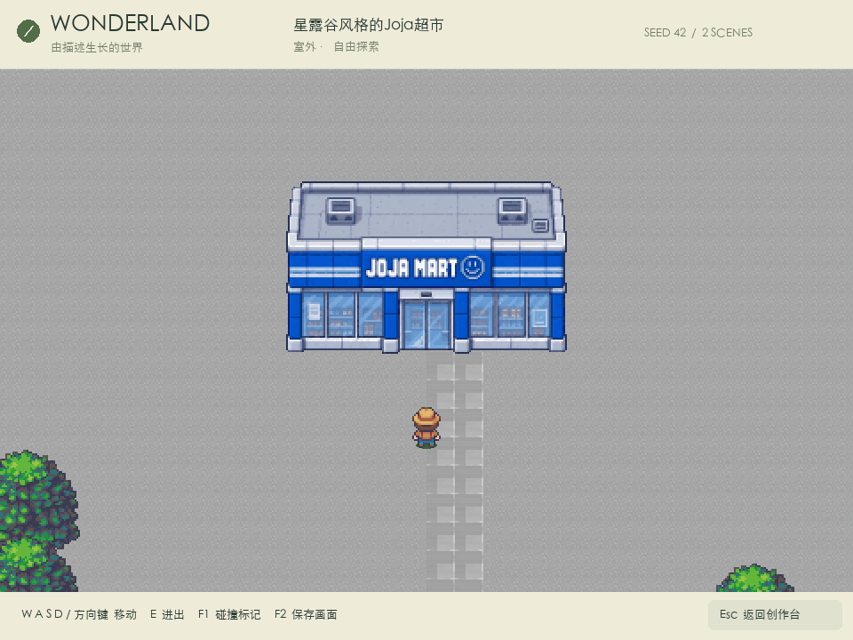 | 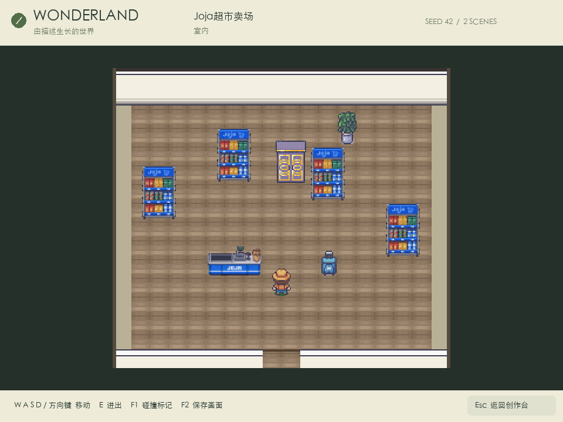 |

蓝色店面连接到摆有商品货架、收银台的卖场，角色可以进入并在店内走动。

### 办公室

> 「我要一个都市场景，有一个可以进入的 office，里面有非常多办公用品」

| 室外 | 室内 |
| :---: | :---: |
| 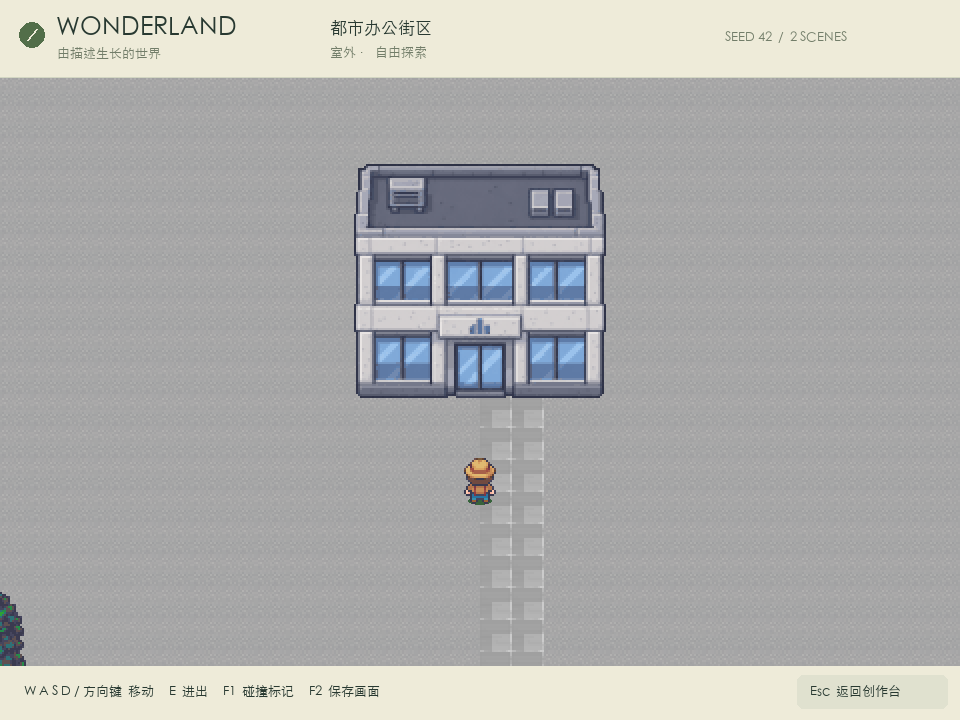 | 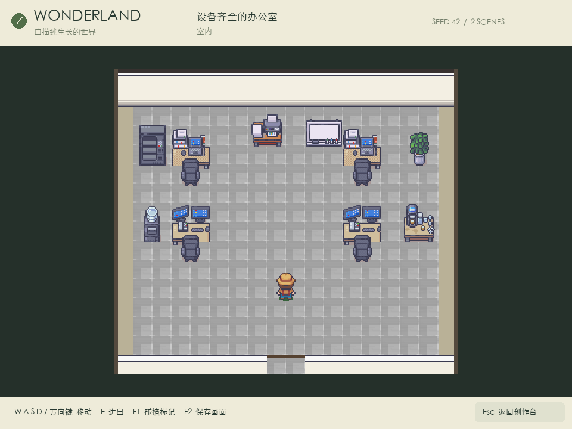 |

办公楼连接到完整的工作空间：电脑、桌椅、办公设备，以及可通行的中央走道。

### 火山魔王城堡

> 「充满岩浆的火山场景，中间有恶魔居住的官邸，进入后是魔王的王宫」

| 室外 | 室内 |
| :---: | :---: |
| 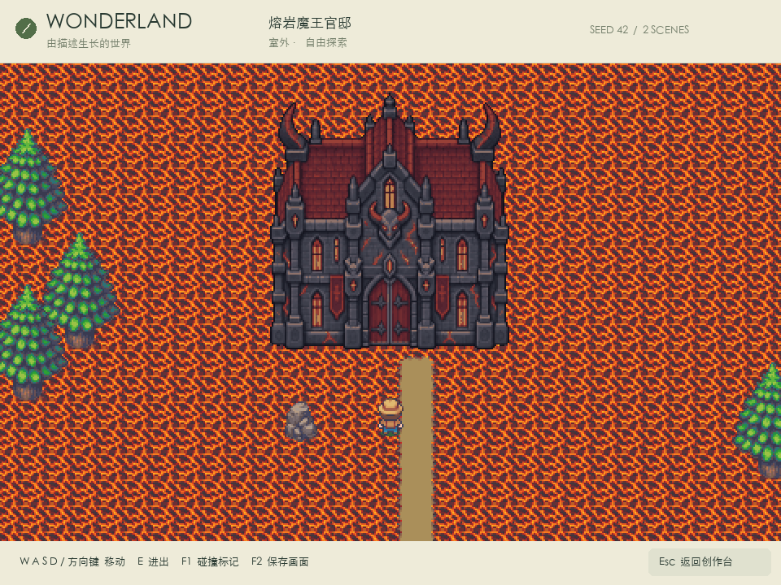 | 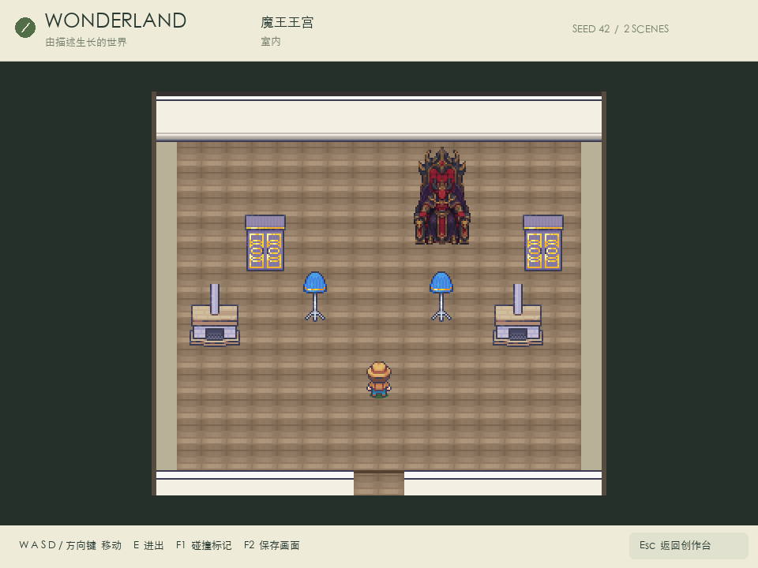 |

岩浆地表、暗色城堡与王座房间，共同组成一个室内外相连的场景。

### 雪山大木屋

> 「雪山场景，有一个巨大的房屋，里面有壁炉和床」

| 室外 · 宽幅取景 | 室内 |
| :---: | :---: |
| 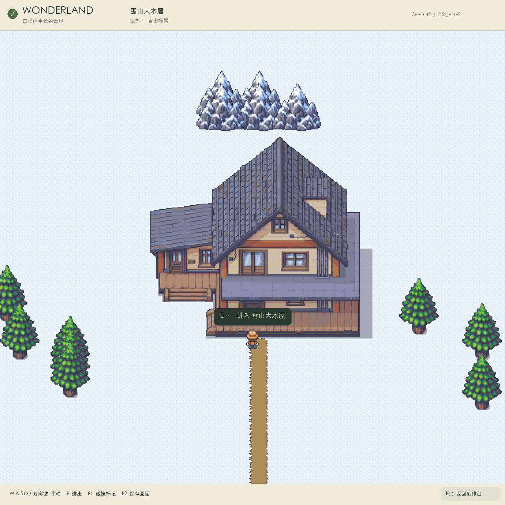 | 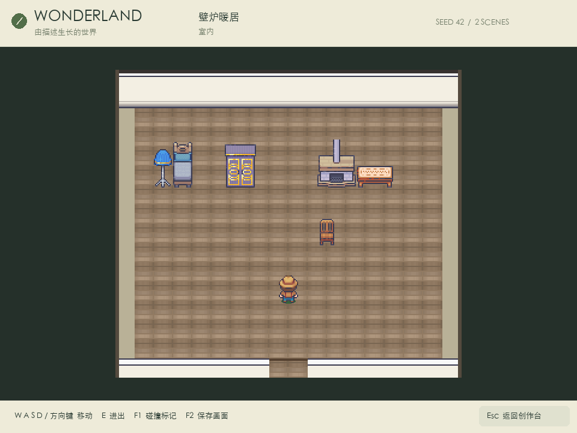 |

积雪地面与山峰布景环绕大木屋，进入后可以探索布置好家具的起居空间。

## 应用实际运行

从前面那句简短的赛博朋克描述出发：走到建筑门口，按 **E**，进入对应室内。以下两帧直接保存在运行中的 macOS 应用里。

| 走到门口 | 进入室内 |
| :---: | :---: |
| 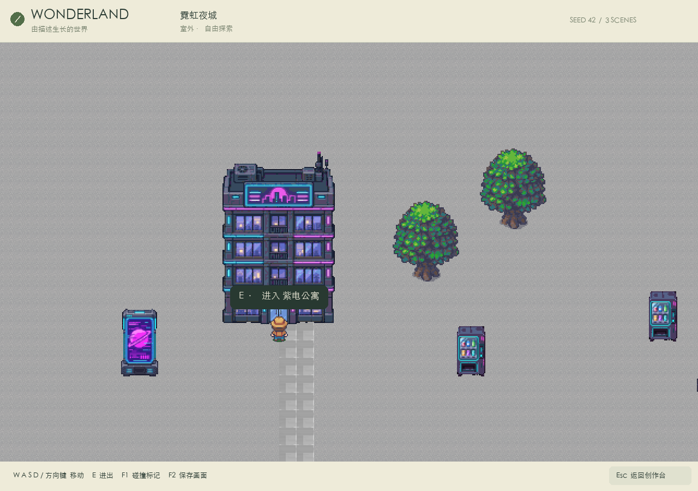 | 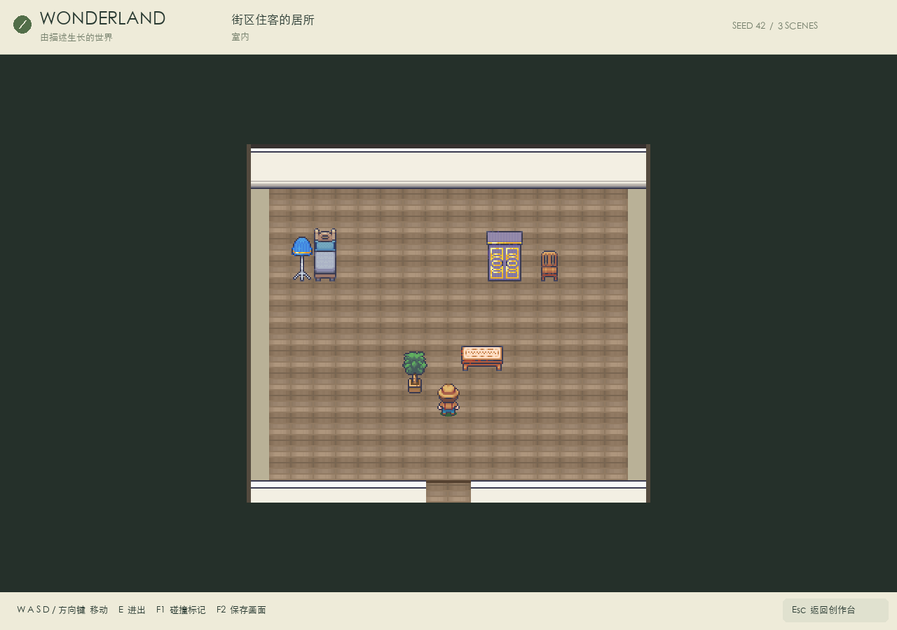 |

| 操作 | 功能 |
| :--- | :--- |
| WASD / 方向键 | 移动 |
| 面向门口按 E | 进入 / 离开 |
| Esc | 返回创作台 |
| F2 | 在创作台或游戏中保存截图 |

## 在本地体验

当前 Demo 在 **macOS** 上开发与测试，需要 **Python 3.11+**。生成新场景需要 OpenAI API key，并在 `config.toml` 中配置账户可用的文本/视觉与生图模型。

```bash
git clone https://github.com/GA10d/Project_Wonderland.git
cd Project_Wonderland
python3.12 -m venv .venv
.venv/bin/python -m pip install -r requirements.lock
```

1. 将自行获取授权的 LimeZu 素材包放入 `assets/raw/`，目录结构对应[素材标注文件](assets/manifests/limezu.json)。本仓库不附带原始素材包，具体见[素材配置说明](assets/README.md)。
2. 在项目根目录创建 `key.env`，填写 `OPENAI_API_KEY=你的密钥`，并在 `config.toml` 中选择账户可用的模型。
3. 导入素材并启动：

```bash
.venv/bin/python -m wonderland assets --import
.venv/bin/python -m wonderland
```

配置完成后，也可以双击 `Launch_Wonderland.command`。输入描述，生成世界，然后点击「开始探索」。

密钥、原始美术、生成素材、世界存档与日志均不提交到 Git；`docs/media/` 中的截图用于本页展示。

[完整使用与开发指南](docs/GUIDE.zh-CN.md) · [架构设计](lectotype/SCENE_GENERATOR_PLAN.md) · [Tilemap 原理](lectotype/README.md)

## 致谢

像素美术使用了 **[LimeZu](https://limezu.itch.io/)** 的授权素材，并结合生成素材。本仓库不分发原始素材包。Joja /《星露谷物语》场景为玩家灵感示例，Wonderland 与原作及其作者没有隶属或背书关系。

## 早期 Demo，继续打磨

**这是一个早期 Demo。** 后续会继续打磨画风一致性、场景布局、素材覆盖、生成可靠性与整体体验。当前主要实现探索、碰撞和房屋进出，尚未提供 NPC 模拟或完整游戏规则系统；生成流程目前优先质量，速度还会逐步优化。

**一个可能的后续方向：用于 AI 跑团的实时场景生成。** 随着主持人描述新地点，或玩家推动剧情，让这些描述即时变成大家可以共同探索的空间。这是未来的探索方向，目前的 Demo 是它的起点。
