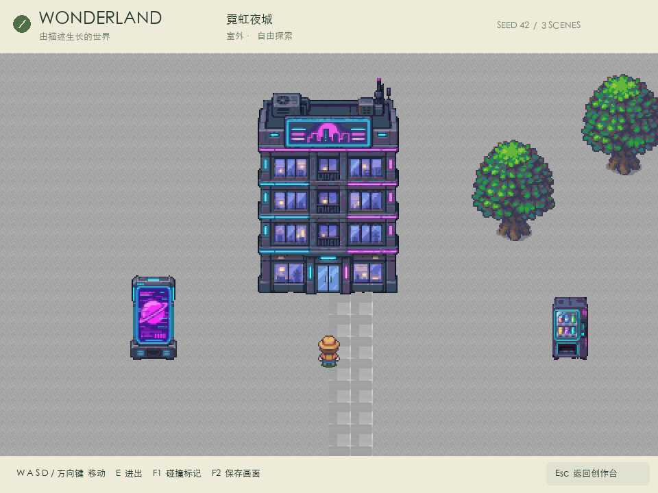
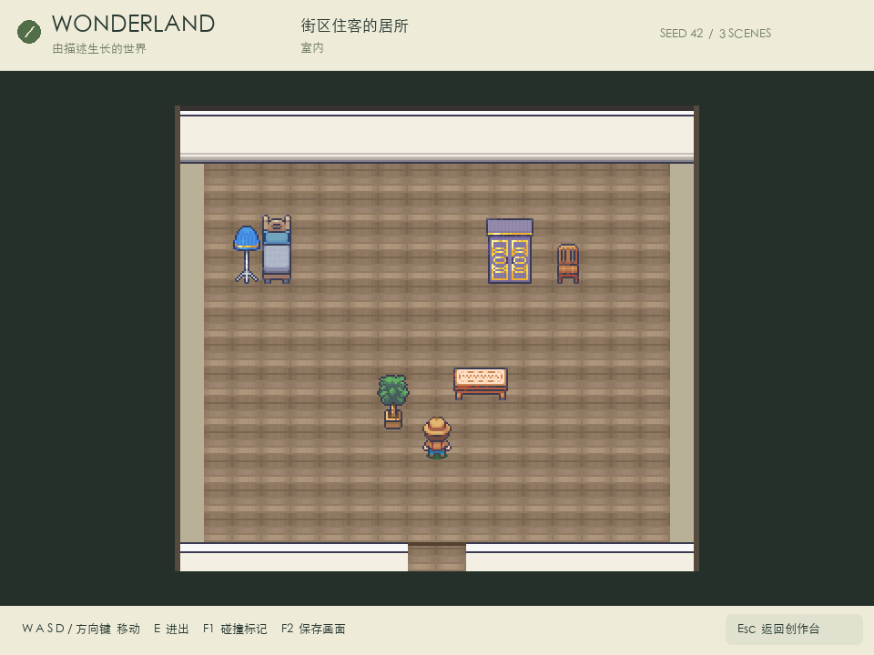

# Showcase captures / 展示截图

[English README](../../README.md) · [简体中文 README](../../README.zh-CN.md)

Captured on 2026-09-10. These images show saved Wonderland scenes rendered by the actual pygame-ce runtime. No scene objects or artwork were added for the screenshots. The gallery changes viewport size for framing; app captures use the running macOS window. PNG compression is lossless.

截图日期：2026-09-10。图片来自已保存的 Wonderland 世界，由实际 pygame-ce 渲染器绘制。拍摄时未添加场景物件或替换美术；展示图通过调整窗口取景，应用图来自运行中的 macOS 窗口，PNG 使用无损压缩。

| Files / 文件 | Source / 来源 | Capture / 拍摄方式 |
| :--- | :--- | :--- |
| `supermarket-exterior.png`, `supermarket-interior.png` | `worlds/14514b028818/world.json` | Game renderer, 960×720 |
| `office-exterior.png`, `office-interior.png` | `worlds/a1318c7e7461/world.json` | Game renderer, 960×720 |
| `volcano-exterior.png`, `volcano-interior.png` | `worlds/9a59e2b1a0a8/world.json` | Game renderer, 960×720 |
| `snow-exterior.png`, `snow-interior.png` | `worlds/76621d0b42b2/world.json` | Exterior 1280×1280 to include the peaks; interior 960×720 |
| `cyberpunk-exterior.png`, `cyberpunk-interior.png` | `worlds/137a764fe0c8/world.json` | Additional game-rendered views, 960×720 |
| `app-studio.png` | Snowy mountain house in the studio / 创作台中的雪山大木屋 | F2 in the live app, 1280×900 |
| `app-explore.png` | Approach the apartment door / 走到公寓门口 | Live keyboard movement, then F2, 1280×900 |
| `app-interior.png` | Enter the apartment / 进入公寓 | Press E in the live app, then F2, 1280×900 |

The exact source prompts are stored with each local world. README quotes normalize whitespace and minor wording for readability; the English version translates the Chinese prompts. These examples use the project's curated assets, procedural layouts, generated artwork, validation, and retry mechanisms. They are demonstrations, not a benchmark of first-attempt success or generation latency.

原始描述保存在各世界文件里；README 引文整理了空白和少量措辞，英文版为中文描述的翻译。示例使用了项目的标注素材、程序布局、生图、验证与重试流程，用于展示功能，不代表首轮成功率或生成时延测试。

## Additional views / 补充视角

| Cyberpunk exterior / 赛博朋克室外 | Apartment interior / 公寓室内 |
| :---: | :---: |
|  |  |

## Artwork / 美术

Screenshots include licensed artwork by [LimeZu](https://limezu.itch.io/) and generated artwork. This folder contains rendered product screenshots, not the original asset packs or an asset distribution license. Joja / Stardew Valley is a fan-inspired example and does not imply endorsement.

截图使用了 [LimeZu](https://limezu.itch.io/) 授权美术与生成素材。本目录提供产品画面，不提供原始素材包或素材分发授权。Joja /《星露谷物语》为灵感示例，不代表原作者背书。
