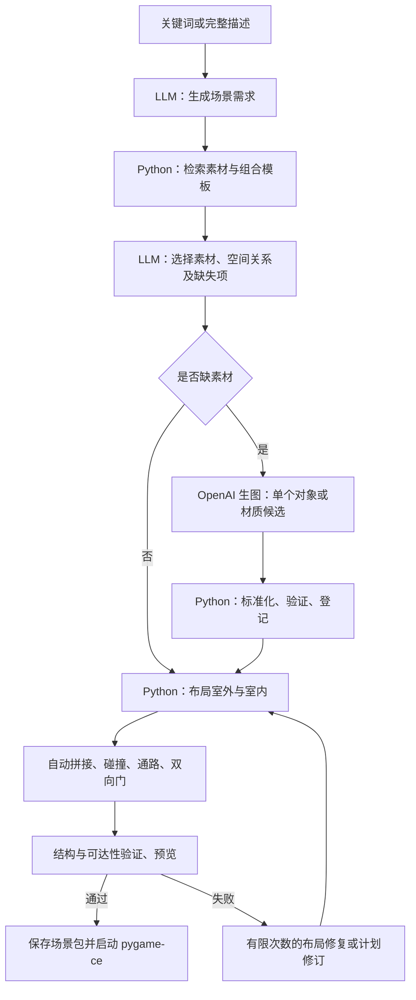

# 描述驱动的交互像素场景：第一阶段方案

日期：2026-09-10。本文保留初始设计方案；第一版实现与已验证能力以项目根目录 `README.md` 为准。

已采纳的用户决定：使用 `assets/raw` 中 LimeZu 系列素材，在 Mac 本地以 Python 开发和渲染；读取并忽略 `key.env`，美术资源同样不进入 Git；第一版优先质量。现已实现原型并完成真实文本/图像 API 调用验证。下面的推荐范围和后续扩展不应视为全部已实现。

## 1. 交付目标与默认范围

输入关键词或完整描述，例如：

> 一片草原，中央有一间红顶木屋，门前有小路，周围有树和发光蘑菇。屋里有床、桌椅和壁炉。

输出一个本地 Python 场景包，并在 Python 游戏窗口中运行：

- 玩家用 WASD / 方向键移动，树干、建筑主体、墙和家具具有碰撞。
- 走到门前出现交互提示，按 E 进入对应室内；在室内出口按 E 返回室外门前。
- 室内由地板、墙、门、家具等可独立摆放的对象构成，能实际走动。
- 已有素材优先复用，缺失素材触发生图和规格化，验证通过后登记并供后续场景复用。
- 保存生成结果；再次打开或进出房屋使用保存的数据，不重新请求模型。

建议先覆盖正交网格、斜俯视、单人、本地桌面运行。首个验收场景为一个约 64×48 格的室外地图和一栋有单层内饰的房屋；数据结构支持多栋房屋各自连接独立室内。地图尺寸是设计默认值，不是性能承诺。

首版支持已定义的交互行为，例如 `enter_scene`。NPC 对话、战斗、任务、多人、任意新玩法和无限世界留待后续。用户提出未支持的机制时要明确指出，不能把一张生成图片当作机制已实现。

## 2. 总体架构



核心边界：LLM 产生受约束的内容计划，Python 将计划转成可验证的游戏世界。游玩帧循环完全在本地运行。

## 3. 哪些事情由模型做，哪些由 Python 做

| 工作 | LLM / 生图模型 | Python |
|---|---|---|
| 理解“温馨草原木屋” | 提取主题、必须出现的东西、可选细节 | 用 schema 校验字段、数量与支持范围 |
| 补全简短关键词 | 选择合理默认值，记录补全内容 | 将默认值写入任务记录并允许调整 |
| 素材选择 | 从检索候选中挑选语义与画风合适的素材 | 按分类、风格、尺寸、质量状态和许可过滤 |
| 房屋组合 | 选择房屋模板、材质、家具清单 | 展开模板，绑定门口、占地和室内引用 |
| 布局意图 | 表达“屋在中央、桌靠窗、树围绕房屋” | 求具体坐标、留通路、避免重叠、有限回退 |
| 地形 | 选择草原、河流、路径等参数 | seed、区域生成、边角 mask、自动选块 |
| 缺失素材 | 写生图说明、可选视觉评价 | 调 API、处理图像、校验、缓存、入库 |
| 互动 | 选已有行为类型及目标 | 移动、碰撞、提示、按键、场景切换 |
| 修复 | 必要时修改不合理的计划 | 优先重排、移除可选障碍、修复路径 |

不让 LLM 逐格输出几千个 tile ID，也不执行 LLM 临时生成的 Python 游戏代码。这样布局可以重现，运行时不会依赖网络响应。

第一版用单个 Python 状态机编排这些步骤即可，暂不需要多个自主 agent 或分布式工作流。可暴露 `search_assets`、`get_recipe`、`request_asset`、`validate_plan` 等有限工具，但工具参数验证、重试次数及费用限制由 Python 执行。

## 4. Python 技术栈

| 模块 | 建议 | 用途 |
|---|---|---|
| 窗口、输入、2D 渲染 | pygame-ce | Tilemap、sprite、相机、动画、碰撞与交互 |
| 语义计划和数据模型 | OpenAI Python SDK + Pydantic | Responses API、结构化数据及本地校验 |
| 素材处理 | Pillow；必要时 NumPy | 切图、调色、透明处理、图像检查 |
| 素材数据库 | SQLite | 索引、标签、版本、生成任务和使用记录 |
| 可读数据 | JSON | 素材 manifest、场景计划、模板和场景包 |
| 路径检查 | Python BFS / A* | 入口、出生点及必要活动区的连通性 |

选择 pygame-ce 是因为第一阶段主要是有限大小的 2D 地图和简单碰撞，便于保持整个运行时为 Python。其 Surface、Sprite 和 Rect/FRect API 可作为实现基础；不会自动替我们解决地形规则和室内外关系。[pygame-ce 文档](https://pyga.me/docs/ref/pygame.html) · [Sprite](https://pyga.me/docs/ref/sprite.html) · [Rect/FRect](https://pyga.me/docs/ref/rect.html)

原型先支持命令行读取 UTF-8 prompt 文件并启动窗口，随后补同一 Python 应用中的文本输入、生成进度和历史场景列表。中文输入需接入文本输入/IME 事件并选择包含中文字形的字体。

API 调用与图片处理在后台任务执行，渲染和输入留在主线程。生成中可取消和恢复；不会卡住窗口事件循环。

## 5. 素材规范：统一尺寸只是第一层

建议一个场景锁定一个 `style_profile`，包含：

- 正交网格、视角、光照方向、描边规则、色板与人物/建筑比例。
- `cell_size_px`：暂定 32；代表运行时一格的标准像素尺寸。
- `art_pixels_per_cell`：实际美术像素密度，选主素材包后固定。
- 素材类别及允许的画布尺寸、地面锚点、透明策略和阴影方式。

如果选用原生 16×16 画风，可以统一用最近邻放大为 32×32，但生成素材也应先适配到同样的 16 像素密度再放大。把原生 16、32、64 的素材统一 resize 到 32，不能自动得到一致画风。正式尺寸应在挑选主素材包后锁定。

地面 tile 必须符合标准格尺寸；房屋、树和床可以是多格对象，例如 128×160 的图片、4×3 格占地。不能把房屋强行压缩成一张 32×32 图。

以下数据彼此独立：

1. 视觉范围与图片锚点。
2. 建造占地，用于对象放置。
3. 角色碰撞，用于墙体、树干和家具。
4. 门前通路、使用家具的站位等预留区。
5. 按地面接触点排序的渲染信息。

## 6. 素材库怎么组织，agent 怎么知道有什么

推荐三个层级：素材包 → 单项素材 → 可交互组合模板。

```text
assets/
  source/                 原始下载包或生成原图，保留来源
  normalized/             统一规格、可供渲染的资源
  manifests/              可版本管理的资源定义
  recipes/                房屋、房间、地形套件等组合模板
  previews/               素材缩略图及联系表
  licenses/               对应版本的使用条款
data/
  assets.sqlite           本地检索索引与任务记录
worlds/<world_id>/
  world.json              场景图与资源版本锁定
  scenes/                 室外、各个室内的编译结果
  generation.json         输入、计划、seed、模型与编译器版本
```

manifest 是资源定义的依据，SQLite 是可重建的检索索引；导入时统一验证并登记，避免两份信息各自修改。

关键记录：

| 记录 | 必要字段 |
|---|---|
| 素材包 | ID、作者、来源 URL、版本、许可、获取时间 |
| 素材 | 稳定 ID、类别、语义标签、中英别名、图片路径/图集区域、尺寸、内容 hash |
| 渲染信息 | 风格 ID、像素密度、锚点、图层/排序方式、动画帧 |
| 空间信息 | 占地、碰撞模板、门位置、通路预留区 |
| 地形族 | 可连接组、地形转换对、mask 到图块映射、完整性检查结果 |
| 组合模板 | 子素材、相对位置、参数槽位、门与室内模板、行为类型 |
| 生成来源 | prompt、模型、参考素材 ID、参数、后处理版本、原图 hash |
| 使用状态 | `candidate / validated / rejected`、验证报告、许可适用范围 |

资源首次导入时，脚本按已知图集网格切分，模型可辅助识别“床/椅子/草地”。但原始 PNG 不会自动提供可靠的碰撞、多格物体边界或 47 种连接语义；首批素材需要制作一次人工核对的 manifest，之后复用。

检索顺序：硬条件过滤 → 标签与别名匹配 → 候选缩略图和摘要提供给 LLM。初期 SQLite 即可；库大后再加 embedding，不需要一开始部署向量数据库。

LLM 只能引用查到的资源 ID。未找到的内容生成 `AssetRequest`，不能凭空编一个已经存在的 asset ID。相同需求先查已验证资源和生成任务缓存，再决定是否发起新的请求。

## 7. itch.io 素材候选与选择原则

先选一套覆盖室外、建筑、室内和角色的主画风，再补同风格缺项。以下是已检查作者页面的候选，尚未下载或逐块审核，不等于已确认满足完整场景需求。

| 候选 | 适用方向 | 已知情况与需要核对的项 |
|---|---|---|
| [LimeZu Modern Interiors](https://limezu.itch.io/moderninteriors) + [Modern Exteriors](https://limezu.itch.io/modernexteriors) | 现代生活、房屋内外、家具 | 同系列覆盖内外，作者提供 16/32/48 尺寸。适合较快做完整进出链路；草原木屋的具体内容仍需检查。完整版本页面要求署名，并限制素材再分发。 |
| [Sprout Lands](https://cupnooble.itch.io/sprout-lands-asset-pack) | 柔和田园、草地、水面和角色 | 风格贴近田园需求；免费版限非商业用途，付费版页面允许商业项目，禁止素材再分发。室内资源覆盖需另行确认。 |
| [Tiny Swords](https://pixelfrog-assets.itch.io/tiny-swords) | 奇幻、城堡和室外建筑 | 页面标注 64×64 网格。当前包许可限制素材再分发；页面另列旧版 CC0 下载，不能混用许可结论。室内家具与角色方向帧需审核。 |

若产品要向其他人提供场景编辑或素材导出，选择依据会不同于仅在本地玩场景。页面允许制作游戏，不等于允许把原始素材随生成器转交给用户。应把是否可随产品分发、是否可导出、是否可作为云端参考图记录为各自的使用条件，而不是只存一个“可商用”布尔值。

可以用 [Kenney Tiny Town](https://kenney.nl/assets/tiny-town) 这类官方标注 CC0 的资源做开放原型；该包是 16×16，也不能据此假设单包已经包含所需内饰。

## 8. 缺失素材的生图流程

### 8.1 规格先于图片

先创建 `AssetRequest`：对象类别、语义要求、目标画布、占地、视角、色板、地面锚点、碰撞模板和允许的参考图。例如“一个 1×1 格发光蘑菇，视觉可高于一格，角色不可穿过底部”。

随后调用 OpenAI Images API 生成或编辑候选图。原生输出与项目 32×32 格子是不同概念：官方图像指南列出的尺寸约束不支持将 32×32 直接作为这里的原生小图输出规格，需要后处理。指南也明确提到跨次生成一致性和精确布局仍存在限制。[OpenAI Image generation](https://developers.openai.com/api/docs/guides/image-generation)

处理流水线：

```text
需求与规格 → 生图候选 → 前景范围/透明检查
 → 裁切与等比适配 → 像素网格重采样与色板约束
 → 标准画布与锚点 → 绑定占地/碰撞/交互模板
 → 技术验证与场景预览 → validated 后入库
```

已有低分辨率素材放大采用最近邻；模型的大图缩到像素画时，需按素材类别选择重采样、量化和轮廓修整方式。最近邻缩小可以作为基线，但不能保证得到优秀像素画，也不能修复错误透视。

透明 PNG 仍须检查实际 alpha；阴影采用统一策略。生成图片的可见轮廓可辅助发现锚点错误，但不能直接当作物理碰撞区域。

### 8.2 不同素材走不同路径

| 类型 | 首版处理方式 |
|---|---|
| 花、蘑菇、标牌、独特家具 | 独立 sprite，规格化后绑定现有对象模板 |
| 新地板、草纹等材质 | 生成材质候选，做重复铺设检查与接缝处理 |
| 新地形边缘族 | 复用已验证的边角形状/子块模板，用材质填充；统一连接边和角的约定，再枚举所有支持的 mask 预览 |
| 新房屋外观 | 适配已知建筑模板的门位置、锚点和占地；超出模板结构的房屋需单独扩展 |
| 行走角色 | 首版优先复用已验证的四方向动画，避免把跨帧一致性作为首个技术难点 |

不能独立生成 47 张毫无共同边界约束的图片，就假设它们能自动无缝拼接。边缘模板法也只保证已定义形状和材质类型，不自动覆盖悬崖、特殊地形交汇等所有情况。

检查尺寸、图集切分、空图、透明、颜色范围和地形规则完整性；渲染重复平铺、内凹角和真实地图预览。边界像素比较只能作为诊断，不能替代视觉检查。可让视觉模型辅助判断风格/门位置，但硬性尺寸和空间规则由 Python 校验。

建议最多两轮修复尝试，次数和费用可配置。必须出现的独特物件不合格时，应报告缺项；不能默默换成别的东西。可选装饰可跳过，并在生成摘要里说明。

## 9. 地图生成与室内外交互

### 9.1 两级场景数据

LLM 输出 `SceneSpec`：主题、区域、实体需求、空间关系、必须/可选项、建筑和室内关系。

Python 编译为 `CompiledWorld`：具体 tile、对象坐标、碰撞形状、门触发区、导航数据、素材版本引用和双向场景连接。

例如 `cottage_001` 关联 `interior_cottage_001`。同一个 exterior sprite 可以复用，但每栋房屋的实例 ID、室内场景 ID 和入口目标必须独立。

seed 用于布局与变体选择；完整重现还需要保存模型输出、素材 hash 和编译器版本。仅靠相同 prompt 或 seed 不能保证模型再次生成相同图片。

### 9.2 生成顺序

1. 生成可建造地形和出生区域。
2. 放置房屋及门前保留区。
3. 连接出生点、门口与主要区域。
4. 生成室内边界、地板和门，再放家具。
5. 放树、岩石等障碍，最后撒小装饰。
6. 自动选边角图块，创建渲染与碰撞数据。
7. 检查室内外入口、出口和必要站位可达。

路径检查应考虑角色碰撞体的宽度；把障碍按角色半径/包围盒扩张，或采用同等效果的可通行区域计算，不能只检查角色中心点是否连通。

### 9.3 按 E 进出

外部门前设置可接近的交互区，房屋主体仍保持实体碰撞。角色站在门前且面向正确方向，按键后切换到室内安全出生点。无需让玩家穿过整栋外观图片。

室内出口同样绑定 `target_scene_id` 和 `target_spawn_id`。切换时保留场景状态，清理本帧交互输入，等待 E 松开后才能再次触发，避免连续传送。出生点不能与家具、墙或当前传送触发区冲突。

角色碰撞使用脚部小矩形；移动采用浮点位置，斜向速度归一化，固定步长或子步进解决低帧率穿透。树和建筑按接地点排序；大建筑或屋顶按模板拆层。

室内在生成场景包时完成并缓存。进入房子不进行新的 LLM 或生图请求。

## 10. API 接入、成本与恢复

- 文本侧使用 Responses API，结合 Structured Outputs / Pydantic 输出固定 schema；函数调用用于请求项目提供的工具。schema 正确仍需业务检查，例如 asset ID 是否存在、门是否连通。[Structured Outputs](https://developers.openai.com/api/docs/guides/structured-outputs) · [Function calling](https://developers.openai.com/api/docs/guides/function-calling)
- 图片侧封装独立的生成/编辑接口；`LLM_MODEL`、`IMAGE_MODEL` 和相应能力放配置，等实际账户与预算确定后选择和实测，不将当前模型名称写死在世界数据逻辑中。
- 使用本机 `OPENAI_API_KEY` 或不进 Git 的本地环境配置；界面和日志不展示密钥。当前规划阶段不需要提供密钥原文。
- 每个生成任务保存进度、输入输出、失败原因、调用次数、usage 和费用估算。设置每场景最大新素材数、尝试次数和预算；发起调用前预留估算额度，完成后核算。
- 仅重试适合重试的临时错误；响应不确定时保留任务状态，不无上限重复发起可能重复计费的图像请求。
- 保存原图和已接受版本。新候选先暂存，验证通过后事务化登记，再原子发布完整场景包。

## 11. 分步实施与验收

| 里程碑 | 内容 | 验收 |
|---|---|---|
| A：本地可玩样板 | 固定场景、角色、树、房屋和室内，素材 manifest | 能走动、不能穿墙；E 进入并返回；屋内家具可绕行 |
| B：素材库与场景编译 | 素材导入、检索、模板、地形规则、布局、存档 | 同一已保存计划/资源/版本下可重建；非法占地和堵门被拒绝或修复 |
| C：描述驱动 | LLM 需求提取、素材选择、室内外规划 | 简短关键词和完整 prompt 都能生成可走通场景 |
| D：缺素材闭环 | 生图、标准化、验证、登记、复用、失败处理 | 请求一种库中没有的装饰，生成后可用；下一次同样请求能复用已接受素材 |
| E：整体验收 | 多组描述、重新加载、预算与失败路径 | 生成包加载后可离线游玩，进出房屋不请求 API；超预算/生图失败给出明确状态 |

所有里程碑合起来才满足第一阶段，包括生图补缺能力。A 是用于尽早验证运行时的内部步骤。

初始验收描述可用：草原木屋、林间小屋、带池塘的庭院；再加入一种独特物件验证素材补缺。还需覆盖多个房屋入口对应正确室内、角色宽度导致的窄通道、离开室内后返回位置正确等案例。

## 12. 开始前需要用户提供或决定的内容

| 项目 | 需要的信息 | 建议默认 |
|---|---|---|
| 画风 | 一两个参考游戏/素材包链接；偏田园、现代还是奇幻 | 柔和田园、斜俯视；尺寸在主素材包选定后锁定 |
| 运行与使用方式 | 先本地自用，还是面向他人的生成器；是否导出可编辑素材/场景 | 先在当前 Mac 本地运行，保存本地场景包 |
| 素材预算 | 仅免费，还是可以购买素材；已有包的本地路径 | 先挑单一主系列，再列出需购买的具体包 |
| API 条件 | 是否已有可用 OpenAI API 项目；已知可用模型；只需告知配置方式 | 本机环境变量，模型可配置；无需在聊天中发送密钥 |
| 生成预算与等待 | 每个场景最高费用、大致能接受多久；质量或速度优先 | 先复用素材，只对缺项生图，设置有限次数修复 |

其中画风与产品使用方式直接影响素材选择；API 配置和费用上限在实际调用前落实即可。若没有强偏好，可以据默认方案先做本地样板。
